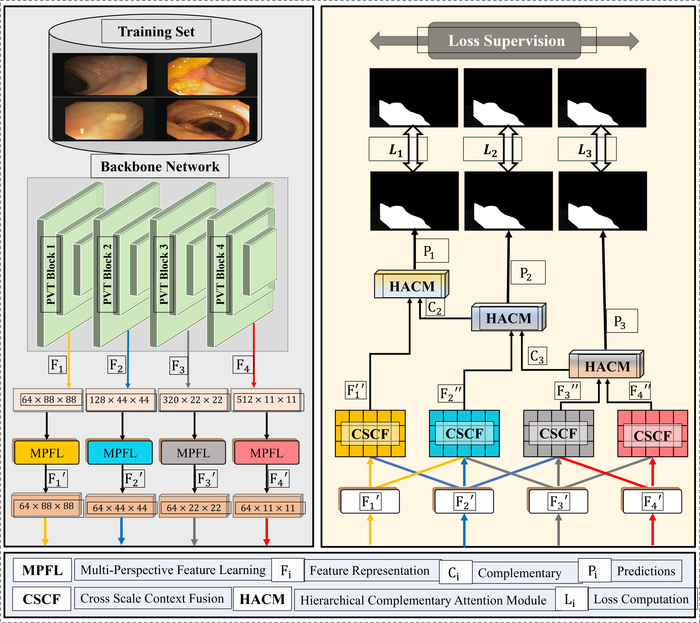

# HMPFormer: Hierarchical vision transformer with multi-perspective feature learning for precise polyp segmentation

## 🔍 Highlights
- **Proposes HMPFormer for accurate polyp segmentation in endoscopic images.
- **Introduces MPFL with dynamic, deformable, and static convolutions.
- **Employs CSCF for adaptive cross-scale feature fusion and enhancement.
- **Uses HCAM with reverse refinement to enhance overlooked polyp regions.

## Network Architecture
Visuall illustration of HMPFormer



## 🖼️ Pre-computed maps
Visual results generated by HMPFormer on various benchmark datasets are publicly available:
📌 [Google Drive](https://drive.google.com/file/d/1i6uz4-2L1xfM4JYHZXXoUQ2k1SsQVnqV/view?usp=sharing)


## 📝 Citation
Please cite our below published studies
```bibtex
@article{usman2025hmpformer,
  title={HMPFormer: Hierarchical vision transformer with multi-perspective feature learning for precise polyp segmentation},
  author={Usman, Muhammad Talha and Khan, Habib and Khan, Haseeb and Rida, Imad and Zhu, Xianxun and Koo, JaKeoung},
  journal={Image and Vision Computing},
  pages={105777},
  year={2025},
  publisher={Elsevier}
}
```

